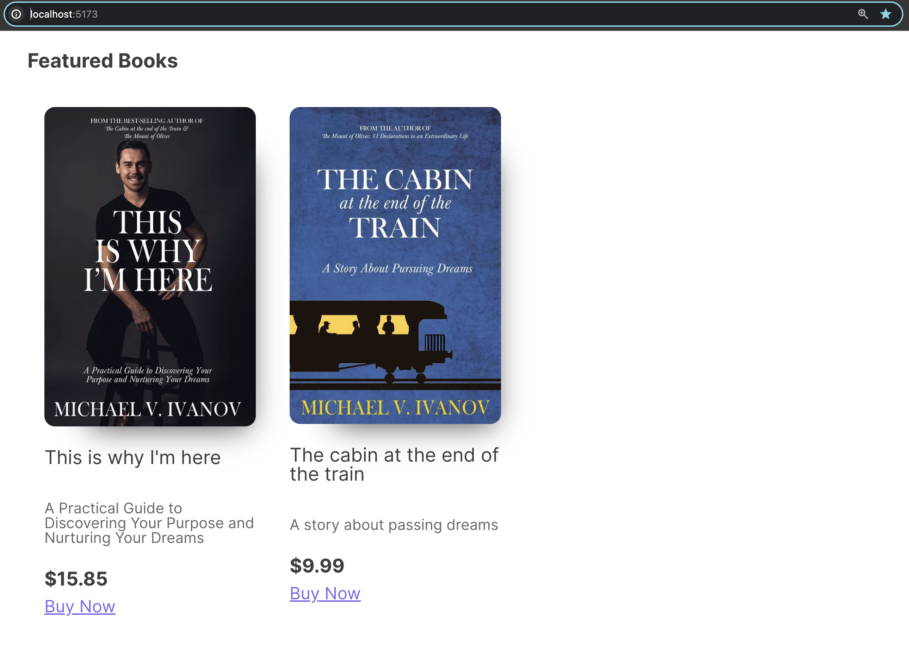

# Lemon Squeezy Basic Payments

A minimalist application meant to demonstrate the basics of using the Lemon Squeexy REST API to connect to an online store

See full tutorial here: https://youtu.be/dHo7lvpU6gs

**Getting Started**

1. Clone repo `git clone <URL>` & `cd lsqy-demo`
2. Install Dependecies: `npm i`
3. Add Lemon Squeezy API key in `lsqConfig` in `main.js`
4. Run server: `npm run dev`
